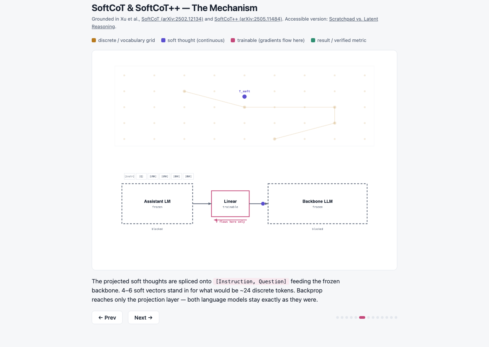

# concept-visualizer

A [Claude Code](https://claude.com/claude-code) skill (plus worked examples)
for building single-concept, learner-driven explainers in the pedagogical
style popularized by [Grant Sanderson's 3Blue1Brown](https://www.3blue1brown.com/):
geometric intuition first, one held visual metaphor, a fixed color-to-meaning
legend, and continuous morphing between states — never a passive autoplay
video, never a wall of prose.

This project is an independent, unaffiliated homage to that teaching style.
It is not produced, reviewed, or endorsed by Grant Sanderson or 3Blue1Brown.


<sub>`examples/softcot/index.html`, step 5 of 12 — the full write-up is in [`examples/softcot/`](examples/softcot/).</sub>

It produces output in two formats from one shared outline:

- **An interactive HTML page** — `<canvas>`-driven, click-through (Prev/Next,
  arrow keys, a dot-per-step progress strip), no autoplay, no dependencies.
  Opens by double-clicking the file.
- **A ManimCE video** — a real [Manim Community Edition](https://www.manim.community/)
  `Scene` rendered to `.mp4`, for when a video artifact is what's actually
  wanted.

These are two separate, hand-authored implementations of the same step/beat
outline — not two renderings of one codebase. See
[`skills/concept-visualizer/SKILL.md`](skills/concept-visualizer/SKILL.md)
for the full authoring workflow.

## The four rules

Every explainer this skill produces — HTML or video — follows the same four
non-negotiable rules:

1. **Geometric intuition before formula.** Step 1 is always a picture, never
   an equation. The formula, if there is one, is earned a few steps in.
2. **One held metaphor.** A single visual object (a vector, a grid, a
   rotating point) transforms across every step. No second, unrelated
   diagram mid-explanation.
3. **Fixed color-to-meaning mapping.** A legend declared once, before step 1.
   A color never means two different things.
4. **Continuity, not jump-cuts.** State changes animate/morph between steps —
   never an instant swap.

Full detail, plus the shared step/beat outline format both output formats
are built from, is in
[`skills/concept-visualizer/SKILL.md`](skills/concept-visualizer/SKILL.md).

## Repo layout

```
skills/concept-visualizer/
  SKILL.md              the skill definition — read this first
  template.html          copy for a new HTML explainer
  template_manim.py      copy for a new Manim Scene
examples/
  rope-rotation/
    index.html            rotary position embeddings, HTML explainer
  attention-scores/
    index.html             Q·Kᵀ → softmax, HTML explainer
    scene.py                the same concept as a ManimCE Scene
    render/attention-scores.mp4   a committed sample render (see below)
  latent-reasoning/
    index.html             scratchpad vs. latent reasoning, HTML explainer
    scene_mechanism.py      PhD-level companion, as a ManimCE Scene
    render/latent-reasoning-mechanism.mp4   committed sample render
  softcot/
    index.html             SoftCoT / SoftCoT++ mechanism, HTML explainer
docs/
  softcot-preview.png       README screenshot (see below)
```

## Using the skill in Claude Code

Copy `skills/concept-visualizer/` into a project's `.claude/skills/`
directory (or reference it directly), then ask Claude to "visualize X" /
"animate how X works" for a math, ML, or general STEM concept. Claude will
draft the step/beat outline first, then build the HTML explainer, the Manim
scene, or both, depending on what you ask for.

## Running the HTML examples

No install needed — just open the file:

```bash
open examples/rope-rotation/index.html
open examples/attention-scores/index.html
open examples/latent-reasoning/index.html
open examples/softcot/index.html
```

`softcot` is the PhD-level companion to `latent-reasoning`: same underlying
topic, but mechanistically accurate rather than allegorical — grounded in
[SoftCoT](https://arxiv.org/abs/2502.12134) and
[SoftCoT++](https://arxiv.org/abs/2505.11484) (Xu et al.). It walks through
the actual architecture (a frozen assistant model, a single trainable linear
projection, a frozen backbone LLM), the real training regime (only the
projection layer ever gets a gradient), and SoftCoT++'s contrastive
test-time-scaling mechanism — with real reported numbers, not illustrative
ones, and the authors' own stated limitations included rather than omitted.
There's also a Manim video covering the same mechanism, one step deeper into
the architecture than the HTML page — see `latent-reasoning/scene_mechanism.py`
below (it lives there rather than in `softcot/` for historical reasons: it
was authored as the mechanistic companion to `latent-reasoning` before
`softcot/` existed as its own example).

`latent-reasoning` is a third kind of example: not a canonical ML mechanism
like the two above, but a visualization of an argument from Ram Kumar's essays
[*"The Scratchpad Is Not the Mind"*](https://medium.com/@billaram/the-scratchpad-is-not-the-mind-41e89b741928)
and [*"The Transcript Is Not the World"*](https://medium.com/@billaram/the-transcript-is-not-the-world-b534180bcf7a) —
chain-of-thought as legible cognitive offloading vs. latent reasoning as a
faster but unauditable continuous path, resolved by a neurosymbolic
"checkable gate" between what a model proposes and what gets trusted. It
shows the skill works for original research arguments, not just textbook
concepts — HTML only for now, no Manim scene yet.

## Running/rendering the Manim examples

This repo manages its own Python environment with [uv](https://docs.astral.sh/uv/)
— it does not touch any other project's virtualenv.

```bash
uv sync                    # installs ManimCE + deps from pyproject.toml
brew install ffmpeg        # if you don't already have it
```

Then render:

```bash
uv run manim -pql examples/attention-scores/scene.py AttentionScores   # quick draft, 480p15
uv run manim -pqm examples/attention-scores/scene.py AttentionScores   # 720p30 (what render/ contains)
uv run manim -pqh examples/attention-scores/scene.py AttentionScores   # final, 1080p60
```

`-p` previews the result after rendering; `-q{l,m,h,k}` sets quality. Output
lands in `./media/videos/<scene-file>/<quality>/<SceneName>.mp4` — that
`media/` directory is Manim's render cache and is gitignored. The two
finished renders this repo ships were copied out of that cache by hand; do
the same if you want to commit a render of your own:

- `examples/attention-scores/render/attention-scores.mp4` — 720p30, ~840KB, 16s
- `examples/latent-reasoning/render/latent-reasoning-mechanism.mp4` — 720p30,
  ~4.4MB, 92s

Both use `Text.set_default(font="Arial")` rather than leaving Manim on its
bundled default font, and avoid two related pitfalls learned the hard way
while building the second video: (1) Manim's bundled default renders as a
dated, low-contrast serif on macOS, and (2) some other fonts that look fine
in isolation — "Helvetica Neue" among them — are `.ttc` font collections that
Pango mis-shapes here, producing broken mid-word kerning. Arial, Verdana, and
Tahoma (all standalone `.ttf` files) were verified to shape correctly; Arial
was picked for its neutral, technical tone. Separately: never call
`.scale()`/`.set(width=...)` on an already-built `Text()` mobject, and never
`Transform()` between two differently-shaped `Text()` mobjects without a
`.become()` snap-back immediately after the `self.play(...)` — both
corrupt glyph spacing in ways that only show up in the specific
strings/scale factors that happen to trigger them, not universally. See
`scene_mechanism.py`'s `show_legend()` and any `beat_*` caption transition
for the working pattern.

### LaTeX status

`template_manim.py` and `examples/attention-scores/scene.py` deliberately use
`manim.Text()` rather than `MathTex`/`Tex` for any on-screen notation, so
they render with **no LaTeX distribution installed at all**. `Text()`
produces plain (if slightly less polished) rendered notation, e.g.
`score(Q, Ki) = (Q . Ki) / sqrt(d)` instead of typeset math.

If you have (or install) a LaTeX distribution — e.g.
`brew install --cask mactex-no-gui` (multi-gigabyte, slow) — you can swap
`Text()` for `MathTex`/`Tex` calls yourself for properly typeset formulas.
This repo does not depend on that being installed; the examples render fully
without it.

## Reviewing an example with a collaborator

For visual feedback or Q&A on a specific explainer — a data scientist
pointing at a step and asking "why is this framed this way?" instead of a
screenshot-and-explain round trip — this repo uses
[`lavish-axi`](https://github.com/kunchenguid/lavish-axi), installed as a
project-scoped skill at `.agents/skills/lavish` (symlinked for Claude Code).
It opens any of the HTML examples in a local browser review session: a
reviewer selects an element or a range of text, leaves an annotation or asks
a question, and that feedback queues up for the agent to address —
in-session, not a separate document.

```bash
npx -y lavish-axi examples/softcot/index.html   # open a review session
npx -y lavish-axi poll examples/softcot/index.html   # (agent-side) wait for feedback
```

Local-first by default — no cloud involved unless the reviewer isn't on the
same machine/network, in which case `lavish-axi share` publishes a link to
[ht-ml.app](https://ht-ml.app) (a third-party host), optionally
password-protected with `--private`. Note the skill installer flags this
package as **medium risk** on its own security assessment (full agent
permissions, third-party npm package) — review it yourself before relying on
it for anything sensitive.

## License

MIT — see [`LICENSE`](LICENSE).
